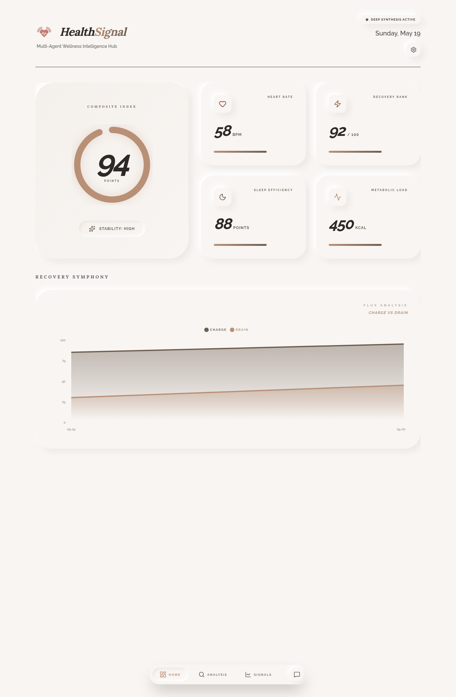
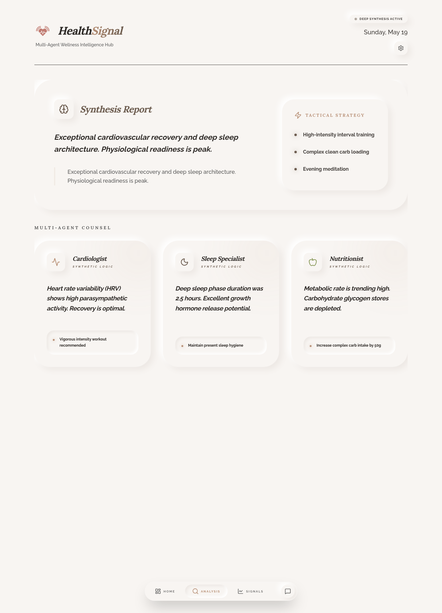
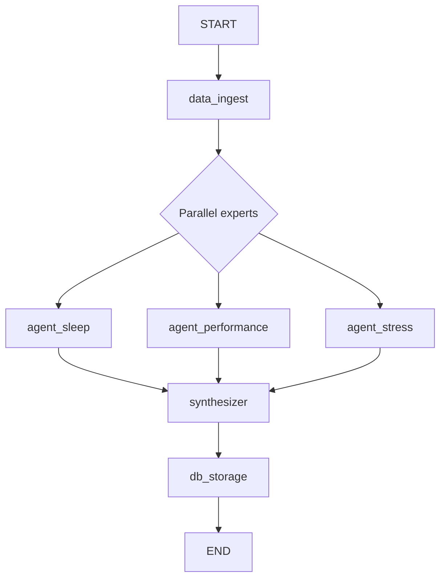

# Health Signal

Turn raw Garmin Connect data into a daily wellness briefing. A LangGraph
"Council of Experts" - three specialized AI agents analyzing sleep,
performance, and stress in parallel, then a synthesizer - produces one
unified narrative and a 1-100 Wellness Score, served on a calm Next.js
dashboard.

Wearables give you metrics; they don't tell you what to do today. Health
Signal closes that gap: every morning your last day of telemetry is fetched,
checked against your own 7-day baseline and clinical reference ranges, and
condensed into a short briefing - summary, prioritized insights, concrete
recommendations, and one score.



The Analysis tab is where the council's work lands - one synthesis report
plus each expert's read:



The dashboard above renders seeded sample data (the app ships with a mock
fallback so it runs with no Garmin account); plug in credentials and the
same pipeline runs on your real telemetry.

## Quickstart

**You need:** Python 3.12+, [uv](https://github.com/astral-sh/uv), Node.js
24+, and a DeepSeek API key. A Garmin Connect account is optional - without
one the pipeline runs on realistic mock data.

```bash
git clone https://github.com/Samiu1/HealthSignal.git && cd HealthSignal

# Configure secrets
cp .env.example .env   # set DEEPSEEK_API_KEY; Garmin creds optional

# Backend: install deps and run the pipeline (last 7 days)
uv sync
uv run python main.py

# Frontend: dashboard on http://localhost:3000
cd web && npm ci && npm run dev
```

Or run the whole thing self-hosted in Docker (dashboard on :3067):

```bash
docker compose up -d --build
```

## What Health Signal can do

| Piece | Status | What it does |
|-------|--------|--------------|
| Garmin ingestion | Live | Stats, sleep, activities, training readiness, respiration, SpO2, HRV, VO2 max; OAuth tokens cached in `~/.garminconnect`; each endpoint fails independently without killing the run |
| Council of Experts | Live | Sleep, performance, and stress agents run in parallel, each prompted with clinical reference ranges and your 7-day history, each returning structured JSON |
| Synthesizer | Live | Resolves conflicts between experts (recovery beats training streak), emits summary, insights, recommendations, and a Pydantic-validated 1-100 score |
| Persistence | Live | SQLite upsert by date keeps the curated analysis and the raw Garmin payload, so prompts can be improved and history reprocessed without re-fetching |
| Dashboard | Live | Next.js 16 + Tailwind 4 + Recharts; reads the database strictly read-only; falls back to demo data when empty |
| Garmin auth + sync from the UI | Live | API routes drive the Python login, MFA/status checks, and a one-click live sync |
| Mock-data mode | Live | No Garmin credentials - or a failed login - still produces a full briefing from realistic sample data |
| CI/CD | Live | Ruff + frontend lint/build in CI; green builds deploy over Tailscale SSH to the self-hosted Docker host |
| LLM output evals | Not built | See [docs/EVALUATIONS.md](docs/EVALUATIONS.md) |

## How it works



1. `main.py` runs the graph once per day for the last 7 days (retroactive
   Garmin corrections get picked up).
2. `data_ingest` authenticates to Garmin Connect (cached tokens first,
   email/password fallback) and maps raw payloads into strict Pydantic
   models. No credentials or a failed login: realistic mock data instead.
3. The three experts analyze in parallel. Each sees only its own vertical
   plus the 7-day trend, so they don't bias each other.
4. The `synthesizer` merges the three reports, flags agreement and
   conflict, and scores the day.
5. `db_storage` upserts everything into a single-table SQLite database that
   the dashboard reads in read-only mode.

Full details in [docs/ARCHITECTURE.md](docs/ARCHITECTURE.md); the original
deep wiki ([docs/index.md](docs/index.md) and siblings) goes deeper on
prompts and philosophy.

## Quality and verification

CI on every push and PR runs two jobs: backend (`ruff check` + the LLM
connectivity test) and frontend (`eslint` + `next build`). Merges to main
deploy automatically to the self-hosted host over Tailscale.

The honest gaps: `test_llm.py` is a connectivity smoke test, not a
behavioral suite - it logs failures instead of asserting them, and there is
no eval harness scoring analysis quality yet. What is checked, what is not,
and the plan: [docs/EVALUATIONS.md](docs/EVALUATIONS.md).

## Product decisions and their tradeoffs

The short version; each decision has context and a revisit trigger in
[docs/DECISIONS.md](docs/DECISIONS.md):

| Decision | Tradeoff accepted |
|----------|-------------------|
| Council of Experts: parallel specialist agents | 4+ LLM calls per day instead of one |
| DeepSeek through the OpenAI-compatible API | Provider lock-in to DeepSeek's API shape |
| Single-table SQLite, raw payload kept | No relational queries; reprocessing is free |
| Dashboard reads SQLite read-only | Pipeline and dashboard must share a filesystem |
| Local-first, self-hosted Docker + Tailscale CD | No multi-user, no hosted offering |
| Mock-data fallback everywhere | A broken Garmin login can look like a healthy pipeline |
| Strict Pydantic models at every boundary | Schema changes touch ingest, storage, and frontend |

## Deliberately not built

Multi-user accounts, a hosted service, other wearable sources (Apple
Health, Whoop, Oura), real-time streaming (the pipeline is a daily batch),
an LLM-judged eval layer, and a mobile app. Health Signal is a personal,
single-user engine - that scope is what keeps the data local and the
architecture small.

## Docs

- [docs/ARCHITECTURE.md](docs/ARCHITECTURE.md) - pipeline, council, storage, dashboard
- [docs/EVALUATIONS.md](docs/EVALUATIONS.md) - CI inventory, honest gaps, eval plan
- [docs/DECISIONS.md](docs/DECISIONS.md) - decision log with tradeoffs and revisit triggers
- [CONTRIBUTING.md](CONTRIBUTING.md) - dev setup and conventions
- [SECURITY.md](SECURITY.md) - privacy rules for health data and secrets
- Deep wiki: [mental model](docs/index.md), [topography](docs/topography.md), [deep dives](docs/deep_dives.md), [developer playbook](docs/developer_playbook.md), [health metrics](docs/health_metrics.md)

## Commands

| Command | Description |
|---------|-------------|
| `uv sync` | Install Python dependencies |
| `uv run python main.py` | Run the pipeline for the last 7 days |
| `uv run python fetch_live.py` | Run the pipeline for today only (what the dashboard's sync button calls) |
| `uv run ruff check .` | Lint the backend |
| `uv run pytest test_llm.py` | LLM connectivity smoke test (needs `DEEPSEEK_API_KEY`) |
| `cd web && npm ci && npm run dev` | Dashboard on :3000 |
| `cd web && npm run lint / npm run build` | Frontend checks |
| `docker compose up -d --build` | Self-hosted run on :3067 |

## Environment variables

| Variable | Required | Notes |
|----------|----------|-------|
| `DEEPSEEK_API_KEY` | Yes | Powers all four agents |
| `GARMIN_EMAIL` / `GARMIN_PASSWORD` | No | Without them the pipeline uses mock data |
| `GARMINCONNECT_IS_CN` | No | Set true for Garmin China accounts |
| `TOKEN_DIR` | No | OAuth token cache (default `~/.garminconnect`) |
| `DB_PATH` | No | SQLite location (default `src/health_data.db`; set in Docker) |
| `GARMIN_SIGN_IN_BREADCRUMBS` | No | Login-flow breadcrumbs for Docker MFA flows |

## Troubleshooting

**Pipeline logs a Garmin login error, then succeeds anyway** - that is the
mock fallback working as designed. Check the log line above it for the real
auth failure.

**Dashboard is empty** - run the pipeline first (`uv run python main.py`),
or use the in-app demo mode. The dashboard reads `DB_PATH` read-only and
never creates it.

**Garmin rate limits** - tokens in `~/.garminconnect` are reused across
runs; delete that directory to force a fresh login.
