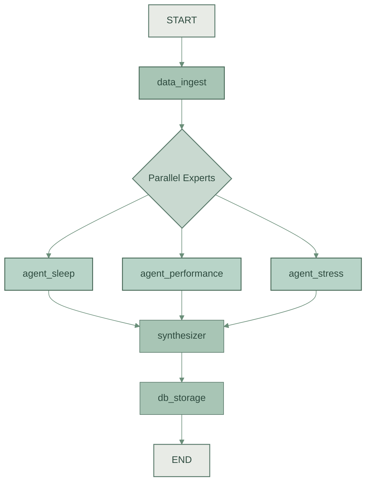

# Health Signal 🌿

<!-- Add project branding/logo here in the future -->

Transform raw Garmin Connect data into actionable lifestyle intelligence using a **Council of Experts** parallel LangGraph architecture and a **Japandi** minimalist dashboard.

Health Signal is a personal health optimization engine. It automates the extraction of complex wearable data and uses specialized AI agents to synthesize "Signal" from "Noise," providing you with a unified narrative and a daily Wellness Score.

---

## 🏛️ Architecture: The Council of Experts

The core of Health Signal is built on **LangGraph**, utilizing a parallel processing pattern after data ingestion. This allows specialized AI agents to analyze distinct verticals without biasing each other until the final synthesis.



### The Experts

1. **Ingestion Node**: Authenticates via Garmin Connect and structures raw payloads. If Garmin credentials fail, the system gracefully falls back to mock data for local development.
2. **Expert Agents (Parallel)**:
   - **Sleep Expert**: Analyzes recovery cycles, sleep score, and REM vs Deep sleep to identify deviations from your baseline.
   - **Performance Expert**: Correlates load, active calories, and cardiovascular readiness to balance exertion and capacity.
   - **Stress Expert**: Evaluates Body Battery depletion, HRV, and resting HR to differentiate eustress from distress.
3. **Synthesizer Node**: Resolves conflicting advice to construct a unified narrative, prioritized insights, and a daily "Wellness Score" (0-100).
4. **Presentation Layer**: A polished **Next.js** dashboard reflecting the Japandi design philosophy.

---

## 🛠️ Tech Stack & Tooling

Health Signal is divided into a Python backend for data processing and a TypeScript frontend for visualization.

### Backend (Data Pipeline & AI)

- **Language**: Python >= 3.12
- **Environment**: `uv` package manager
- **AI Framework**: LangGraph (`>=1.1.2`), LangChain (`>=1.2.18`) with DeepSeek
- **Data Integration**: `garminconnect` (`>=0.2.38`)
- **Database**: SQLite3
- **Data Manipulation**: Pandas (`>=2.3.3`), Pydantic (`>=2.12.5`), Plotly (`>=6.6.0`)

### Frontend (Web Dashboard)

- **Framework**: Next.js 15 (App Router)
- **Language**: TypeScript
- **Styling**: Tailwind CSS 4.0
- **Animations**: Framer Motion
- **Icons**: Lucide React
- **Database Access**: `better-sqlite3`

---

## 🚀 Getting Started

Follow these steps to set up both the backend data pipeline and the frontend web dashboard.

### Prerequisites

- [Python 3.12+](https://www.python.org/downloads/)
- [uv](https://github.com/astral-sh/uv) (for ultra-fast Python package management)
- [Node.js 20+](https://nodejs.org/en/)
- [pnpm](https://pnpm.io/) or `npm`
- DeepSeek API Key (for the AI analysis)
- Garmin Connect Account (Optional, falls back to mock data if omitted)

### 1. Clone the Repository

```bash
git clone https://github.com/your-username/health-signal.git
cd health-signal
```

### 2. Configure Environment Variables

Create a `.env` file in the root directory. You can use `.env.example` as a template:

```bash
cp .env.example .env
```

| Variable              | Description                                        | Required |
| :-------------------- | :------------------------------------------------- | :------- |
| `DEEPSEEK_API_KEY`  | Your API key for DeepSeek.                          | Yes      |
| `GARMIN_EMAIL`      | The email address for your Garmin Connect account. | No*      |
| `GARMIN_PASSWORD`   | The password for your Garmin Connect account.      | No*      |

*\*Note: If Garmin credentials are not provided or authentication fails, the application will automatically use mock data for safe, seamless local development.*

**Garmin Token Caching:** On the first successful login, OAuth tokens are dumped into `~/.garminconnect` to avoid repeatedly hitting Garmin with hardcoded credentials.

### 3. Set Up the Backend Data Pipeline

Navigate to the project root and install the Python dependencies using `uv`:

```bash
uv venv
source .venv/bin/activate  # On Windows use: .venv\Scripts\activate
uv pip install -e .
```

### 4. Run the AI Pipeline

Execute the LangGraph agent to fetch and analyze your recent Garmin health data. By default, it processes the last 7 days to capture retroactive changes.

```bash
python main.py
```

This will run the Council of Experts and populate the `src/health_data.db` SQLite database with both raw JSON payloads and structured AI analysis.

### 5. Set Up the Web Dashboard

Open a new terminal, navigate to the `web/` directory, and start the Next.js development server:

```bash
cd web
npm install
npm run dev
```

Open [http://localhost:3000](http://localhost:3000) in your browser to view your personalized dashboard.

---

## 🗺️ System Topography

A brief overview of the directory structure to help you navigate the codebase:

```text
.
├── docs/                     # Comprehensive "Deep Wiki" documentation
├── src/                      # Python Backend (Logic & Utilities)
│   ├── graph/                # LangGraph Core
│   │   ├── nodes/            # Pipeline execution steps (Agents)
│   │   ├── main.py           # Graph builder
│   │   └── state.py          # Pydantic state definition
│   ├── utils/                # DB, Garmin, and LLM utilities
│   └── health_data.db        # SQLite database (Read-only for frontend)
├── web/                      # Next.js Dashboard (Japandi Minimal)
│   ├── src/app/              # Next.js App Router (Dashboard)
│   └── src/components/       # UI Components & Charts
├── main.py                   # Root entry point for the AI data pipeline
└── pyproject.toml            # Python build configuration
```

For a deeper dive into specific components, refer to the documentation:

- [**The Mental Model**](docs/index.md): Vision, core logic, and design philosophy.
- [**System Topography**](docs/topography.md): Detailed directory rules and schema.
- [**Logic Deep Dives**](docs/deep_dives.md): Detailed agent prompts, persistence strategies, and parallel processing logic.
- [**Developer Playbook**](docs/developer_playbook.md): Environment setup and common workflows.

---

## 💾 Data Persistence Strategy

Health Signal uses a clean, single-table SQLite schema (`daily_health`) optimized for simple read queries from the Next.js frontend.

- **Storage**: We store both the curated AI analysis and the raw Garmin JSON payload in JSON blobs. This allows the AI model to re-process historical data without needing to re-fetch from the Garmin API if prompts are improved.
- **Upsert Logic**: The `date` column is `UNIQUE`. If the pipeline runs multiple times for the same day, we use an upsert strategy (`ON CONFLICT(date) DO UPDATE`) to regenerate the AI analysis and update the row.
- **Access**: The frontend connects to the database in a purely Read-Only mode to prevent accidental corruption.

---

## 🤝 Contributing

Contributions are welcome! Please see the [Developer Playbook](docs/developer_playbook.md) for detailed contribution guidelines, architectural rules, and coding standards.

## 📄 License

This project is licensed under the MIT License.
