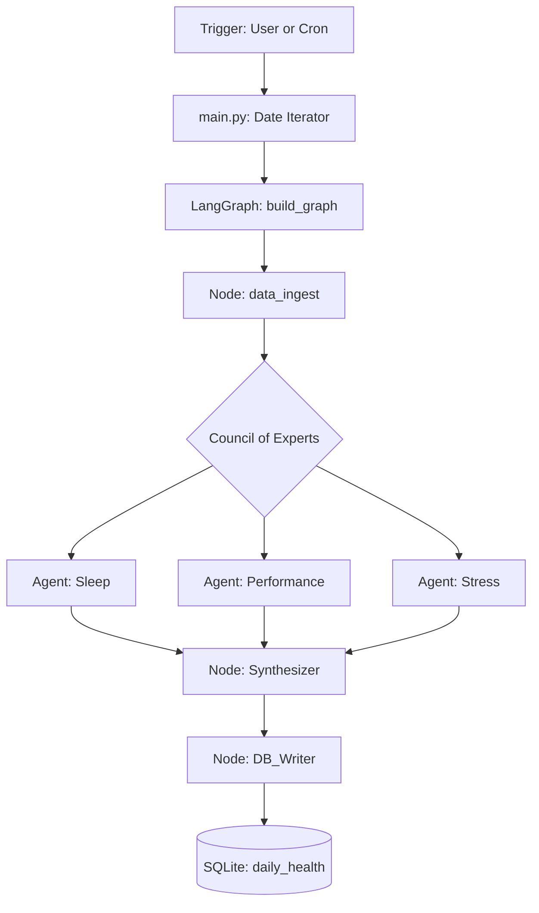

# Logic Deep-Dives

## 1. The Processing Pipeline (LangGraph)
# Deep Dives: The Council of Experts

## Parallel Processing Logic
Health Signal utilizes a **Parallel StateGraph** pattern. Instead of a linear sequence, the system "fans out" after data ingestion to three specialized domain experts. This ensures that the analysis for one vertical (e.g., Sleep) is not biased by the raw data of another (e.g., Heart Rate) until the synthesis phase.

### 1. `agent_sleep`
- **Focus**: Sleep hygiene, architecture, and circadian rhythm.
- **Metrics Analyzed**: Sleep score, REM duration, Deep sleep duration, Awake time.
- **Goal**: Identify deviations from the user's baseline sleep pattern and suggest specific behavioral changes (e.g., "Earlier wind-down routine").

### 2. `agent_performance`
- **Focus**: Cardiovascular load, recovery, and readiness.
- **Metrics Analyzed**: Resting Heart Rate (RHR), Active Calories, Training Load.
- **Goal**: Balance physical exertion with physiological capacity. It identifies when the user is overreaching or when they are primed for peak performance.

### 3. `agent_stress`
- **Focus**: Nervous system balance and stress resilience.
- **Metrics Analyzed**: Average Stress Level, Body Battery high/low, HRV (where available).
- **Goal**: Differentiate between "eustress" (good stress from exercise) and "distress" (chronic stress). It provides insights into day-to-day resilience.

## Data Acquisition (Garmin API)
The system leverages the [garminconnect](https://github.com/cyberjunky/python-garminconnect) Python library, which interfaces with Garmin's cloud services.

### Gathered Data Points
The pipeline actively extracts the following metrics from your Garmin account:

| Category | Metrics Collected |
| :--- | :--- |
| **Daily Health** | Total Steps, Resting HR, Active Calories, Stress Level (Avg), Body Battery (High/Low), Respiration Rate, SpO2, HRV (Nightly) |
| **Sleep Quality** | Duration, Sleep Score (0-100), Deep Sleep, REM Sleep, Awake Time |
| **Training** | Activity Type, Distance, Duration, Heart Rate (Avg/Max), Calories Burned, VO2 Max |
| **Readiness** | Training Readiness Score, Recovery Time (hours), Chronic Training Load |

### Authentication & Security
- **Secure Token Storage**: On the first successful login, the system dumps Oauth tokens into a local `TOKEN_DIR` (defaults to `~/.garminconnect`). Subsequent runs use these tokens to avoid hitting Garmin with credentials.
- **Environment Variables**: Sensitive data is never hardcoded. It is pulled from `.env` using `GARMIN_EMAIL` and `GARMIN_PASSWORD`.

### Expanded Data Potential
While the current pipeline focuses on daily wellness, the `garminconnect` library provides access to 100+ endpoints. Below are additional data points that could be integrated into future experts:

| Category | Potential Metrics |
| :--- | :--- |
| **Advanced Health** | Hydration (manual logs), Breathing Disruption (Sleep) |
| **Fitness Performance** | Fitness Age, Heart Rate Variability (HRV) Trends, Floor Climbing |
| **Biometrics** | Body Composition (Weight, BMI, Body Fat %), Blood Pressure Logs |
| **Social & Goals** | Earned Badges, Active Challenges, Personal Records (PRs) |
| **Life Tracking** | Menstrual Cycle Summary, Pregnancy Tracking, Gear (Shoe/Bike mileage) |

## Execution Lifecycle
The AI Pipeline is designed as a **7-Day Rolling Analysis**. It is typically triggered manually via `python main.py`, which iterates through the last week to ensure all metrics are backfilled and up-to-date.

## Daily Record Storage
**Question**: Do we store responses per day in the DB?
**Answer**: Yes. The system maintains exactly one canonical record per day in the `daily_health` table.

- **Unique Constraint**: The `date` column is `UNIQUE`.
- **Upsert Logic**: We use `ON CONFLICT(date) DO UPDATE`. If the pipeline runs multiple times for the same day (e.g., more Garmin data syncs later in the evening), the AI analysis is regenerated and the row is updated.
- **Backfill**: By default, `main.py` re-analyzes the last 7 days to capture any retroactive changes in Garmin's calculations (like Sleep Score updates).

## The Synthesis Phase
Once all three experts have pushed their insights to the `HealthState`, the `synthesizer` node executes.
- **Objective**: Resolve conflicts between experts (e.g., if sleep is poor but performance metrics are high).
- **Output**: A unified "Wellness Report" including a weighted overall score and a prioritized list of 3-5 daily recommendations.

## Technical Gotchas

### State Fan-In
In LangGraph, parallel nodes must ensure they don't overwrite the same key in the `HealthState` unless intentional. Each expert writes to a specific `expert_insights` list, which is then parsed by the synthesizer.

### LLM Token Usage
Running three parallel agents plus a synthesizer means a single pipeline run consumes roughly 4x the tokens of a single-node analysis. We mitigate this by using strict system prompts to keep expert outputs concise and structured.

---

## 2. Persistence Layer (SQLite)

### Schema Design
The database uses a single table `daily_health` with a `date` index.
- **Philosophy**: We store both the curated AI analysis AND the raw JSON payload.
- **Rationale**: If the AI model improves or the prompt changes, we can re-process historical data without needing to re-fetch from the Garmin API.

### State & Data Interaction
Frontends use **Read-Only Connections** by default to prevent accidental data corruption during dashboarding.

---

## 3. The "Gotchas" & Trade-offs

### Python vs. TypeScript Dualism
- **Trade-off**: Maintains two sets of DB logic (`utils/db.py` and `lib/db.ts`).
- **Rationale**: Better DX for both Streamlit developers and Next.js developers.
- **Risk**: Schema changes must be manually synced across both paradigms.

### Mock Data Strategy
- **Logic**: If the Garmin login fails or credentials are missing, the system injects `get_mock_data()`.
- **Warning**: This ensures the pipeline always "works" for demos, but developers must check logs to see if they are viewing real or synthetic data.
