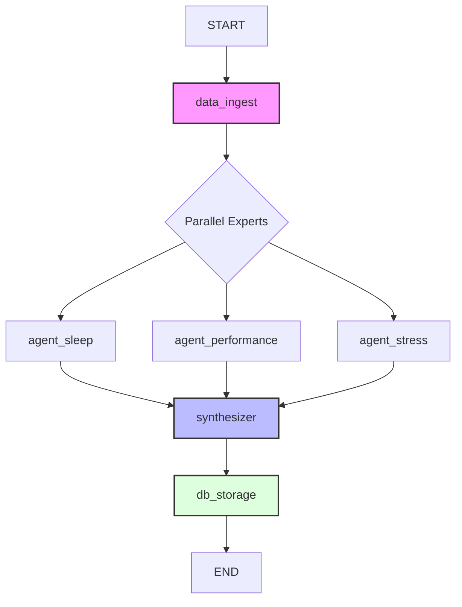
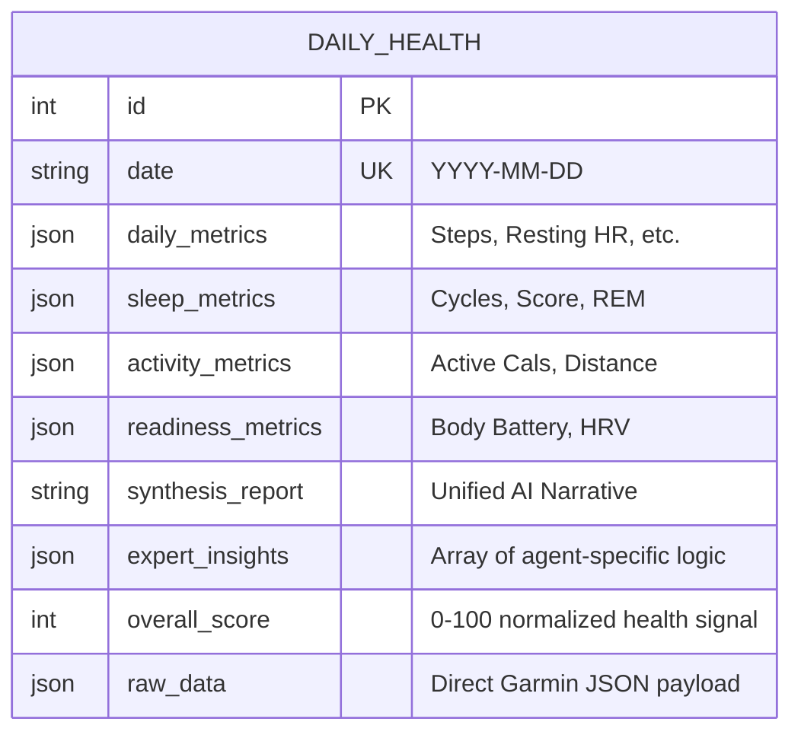

# System Topography

## Directory Philosophy

The Health Signal repository is divided into two primary environments: a **Python Backend** (data processing) and a **Dual Frontend** (dashboarding).

### `/src` (The Core Engine)
- **Purpose**: Contains the LangGraph pipeline, data extraction logic, and database utilities.
- **Rules**:
    - **DO**: Place node logic in `graph/nodes/`.
    - **DO**: Place shared Pydantic types in `graph/state.py`.
    - **NEVER**: Include UI-specific code (HTML/React) directly here.
    - **NEVER**: Store persistent data (DBs, logs) in the Git-tracked `src/` folder; use the root or a ignored data directory.

### `/web` (The Next.js Application)
- **Purpose**: A modern React frontend built for high-performance data presentation.
- **Rules**:
    - **DO**: Use Server Components for database fetching.
    - **DO**: Maintain strict Tailwind isolation for themes.
    - **NEVER**: Place heavy data transformation logic here; it should be handled in the pipeline.

### `/scripts` (Dev Ops & Tools)
- **Purpose**: Automation scripts for database migrations, local testing, and mock data generation.

---

## System Topography

## Directory Structure
```text
.
├── src/
│   ├── graph/           # LangGraph Core
│   │   ├── main.py      # Entry point for the Council of Experts
│   │   ├── state.py      # Pydantic state definition
│   │   └── nodes/       # Logic for ingestion, analysis agents, and storage
│   └── utils/           # Database and LLM helpers
├── web/                 # Next.js Dashboard (Japandi Minimal)
├── docs/                # Architecture & Guidebook
└── data/                # Local SQLite storage (gitignored)
```

## The Data Lifecycle
Below is the visualization of how health metrics move through the `Council of Experts` pipeline.



## Data Schema
The project uses a clean, single-table schema to store high-fidelity health snapshots. This design prioritizes query simplicity for the Next.js frontend.



## Persistence Logic
- **Database**: `src/health_data.db` (SQLite).
- **Schema**: Single table `daily_health` storing daily snapshots and expert insights.
- **JSON Blobs**: We favor JSON columns for metrics to allow schema flexibility without migrations.
/db.py` in Python, `lib/db.ts` in Next.js).
