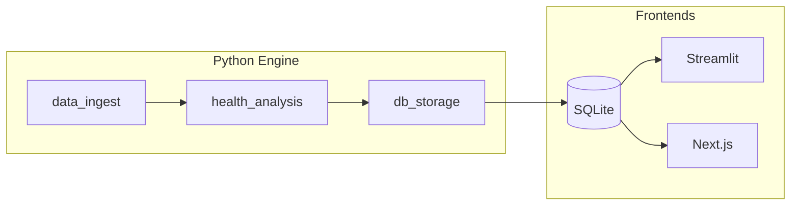

# System Topography

## Directory Philosophy

The Health Signal repository is divided into two primary environments: a **Python Backend** (data processing) and a **Dual Frontend** (dashboarding).

### `/src` (The Core Engine)
- **Purpose**: Contains the LangGraph pipeline, data extraction logic, and database utilities.
- **Rules**:
    - **DO**: Place node logic in `graph/nodes/`.
    - **DO**: Place shared Pydantic types in `graph/state.py`.
    - **NEVER**: Include UI-specific code (HTML/React) directly here.
    - **NEVER**: Store persistent data (DBs, logs) in the Git-tracked `src/` folder; use the root or a ignored data directory.

### `/web` (The Next.js Application)
- **Purpose**: A modern React frontend built for high-performance data presentation.
- **Rules**:
    - **DO**: Use Server Components for database fetching.
    - **DO**: Maintain strict Tailwind isolation for themes.
    - **NEVER**: Place heavy data transformation logic here; it should be handled in the pipeline.

### `/scripts` (Dev Ops & Tools)
- **Purpose**: Automation scripts for database migrations, local testing, and mock data generation.

---

## Dependency Graph

### External Dependencies
1.  **GarminConnect**: Main data source API. High volatility; requires session token management.
2.  **LangGraph**: Orchestrates the analysis pipeline. Handles state persistence and node ordering.
3.  **Claude 3.5 Sonnet (Anthropic)**: The "brain" of the project. Used for multi-modal correlation of health data.
4.  **SQLite**: Local persistence for structured data.

### Internal Interactions

- **State Link**: Node A, B, and C communicate via `HealthState`.
- **Database Link**: Frontends access the DB using localized adapters (`utils/db.py` in Python, `lib/db.ts` in Next.js).
